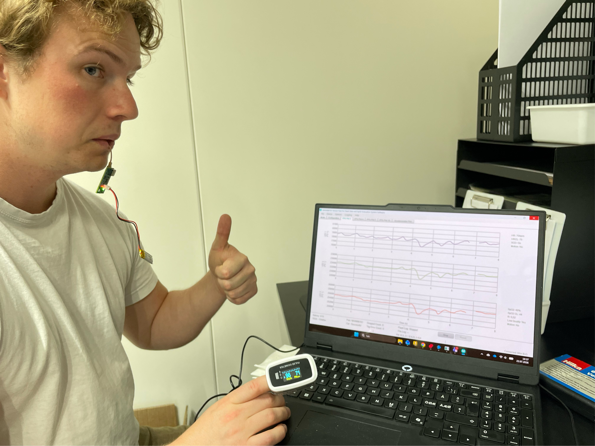
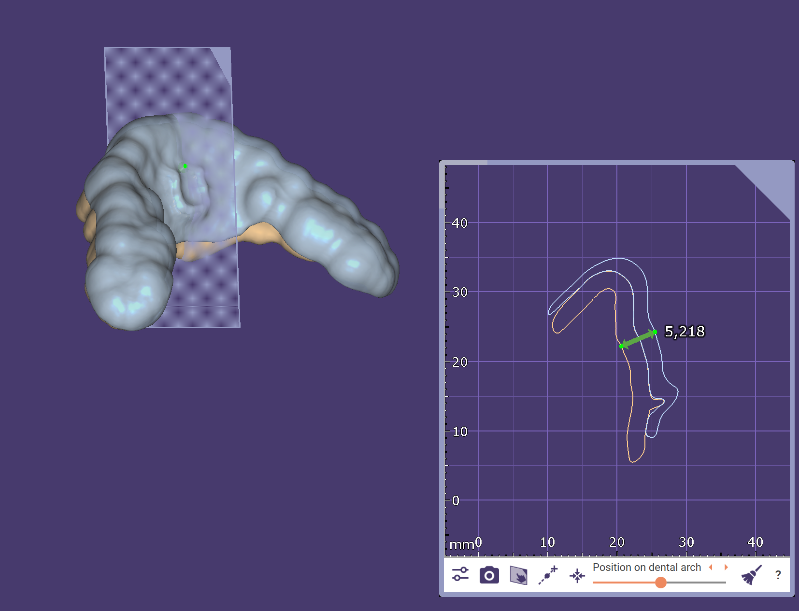
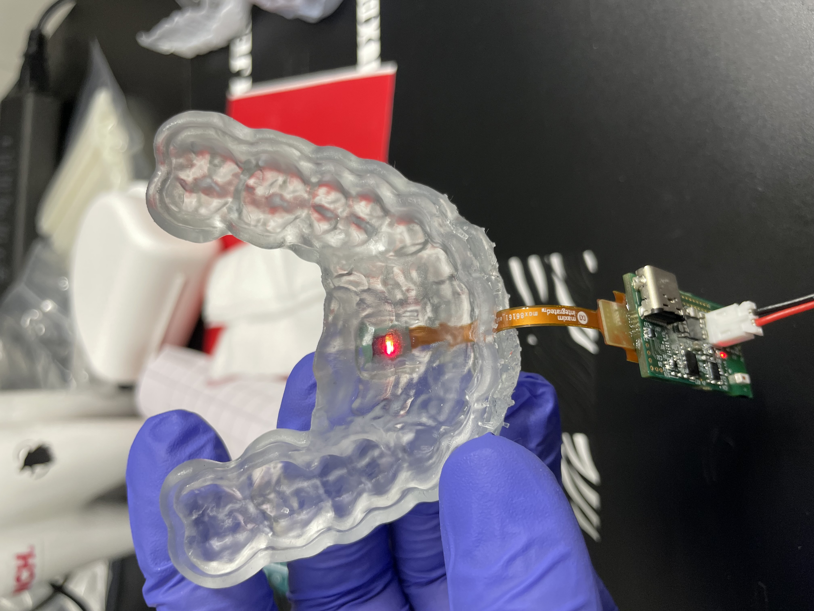

# Clench

Embedded sensor integration in a **mouthguard** — a wearable sensor device.

## About

Ongoing project at the **Eik Lab** at NMBU, integrating sensors into a mouthguard to measure
wear and bite behavior. Combines embedded firmware with physical integration into the device.

## Gallery

## Status

:::note[Status]
Ongoing development under the Eik Lab.
:::